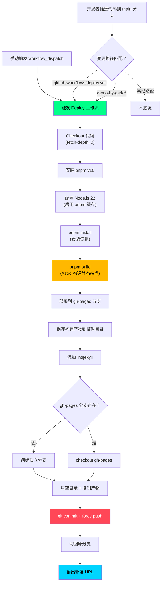
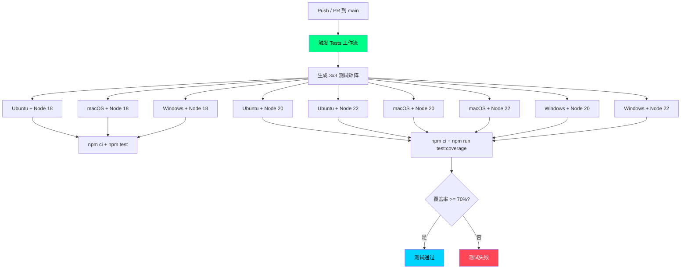

# CI/CD 流水线文档

> 本文档全面介绍 get-shit-done-study 项目及其子项目中所有 CI/CD 工作流的架构、配置和运维指南。

## 目录

- [CI/CD 架构概览](#cicd-架构概览)
- [工作流详细分析](#工作流详细分析)
  - [1. Deploy to GitHub Pages（项目级）](#1-deploy-to-github-pages项目级)
  - [2. Tests（GSD 框架）](#2-testsgsd-框架)
  - [3. Auto-label new issues（GSD 框架）](#3-auto-label-new-issuesgsd-框架)
- [构建产物说明](#构建产物说明)
- [部署流程图](#部署流程图)
- [常见 CI/CD 问题排查](#常见-cicd-问题排查)
- [如何修改工作流](#如何修改工作流)

---

## CI/CD 架构概览

本项目采用 **Monorepo 结构**，CI/CD 配置分布在两个层级：

| 层级 | 路径 | 工作流数量 | 用途 |
|------|------|-----------|------|
| **项目根目录** | `.github/workflows/` | 1 个 | Demo 应用的构建与部署 |
| **GSD 框架** | `get-shit-done/.github/workflows/` | 2 个 | 框架自身的测试与 Issue 管理 |

### 工作流清单

| 工作流名称 | 所在层级 | 触发方式 | 部署目标 |
|------------|---------|---------|---------|
| Deploy to GitHub Pages | 项目根目录 | push + 手动 | GitHub Pages |
| Tests | GSD 框架 | push + PR | 无（仅测试） |
| Auto-label new issues | GSD 框架 | Issue 事件 | 无（标签管理） |

### 架构关系

```
get-shit-done-study/                    <-- 项目根目录
├── .github/
│   └── workflows/
│       └── deploy.yml                  <-- Demo 应用部署流水线
├── demo-by-gsd/                        <-- Astro 静态站点
│   ├── astro.config.mjs                <-- 构建配置（base path 等）
│   └── package.json                    <-- pnpm 管理依赖
└── get-shit-done/                      <-- GSD 框架（子目录）
    └── .github/
        └── workflows/
            ├── test.yml                <-- 多平台多版本测试
            └── auto-label-issues.yml   <-- Issue 自动标签
```

> **注意**：`get-shit-done/` 目录下的 `.github/workflows/` **仅在 GSD 框架的原始仓库中生效**。在本项目的 monorepo 中，GitHub Actions 不会自动识别子目录中的工作流文件。这些文件仅作为学习参考保留。

---

## 工作流详细分析

### 1. Deploy to GitHub Pages（项目级）

**文件路径**：`.github/workflows/deploy.yml`

#### 触发条件

| 触发方式 | 条件 |
|---------|------|
| **Push** | 分支为 `main`，且文件变更匹配 `demo-by-gsd/**` 或 `.github/workflows/deploy.yml` |
| **手动触发** | 通过 GitHub Actions 页面点击 "Run workflow" 按钮 |

#### 权限设置

```yaml
permissions:
  contents: write    # 需要写入权限以推送 gh-pages 分支
```

#### 并发控制

```yaml
concurrency:
  group: "pages"
  cancel-in-progress: false    # 不取消正在运行的部署，确保部署完整性
```

- 同一时刻只允许一个部署任务运行
- 新触发的部署会**等待**前一个完成，而不是取消它
- 这避免了 `git push --force` 竞争条件导致的部署失败

#### 执行步骤详解

| 步骤 | 使用的 Action | 说明 |
|------|-------------|------|
| Checkout | `actions/checkout@v4` | 拉取代码，`fetch-depth: 0` 获取完整 Git 历史（gh-pages 分支切换需要） |
| Install pnpm | `pnpm/action-setup@v4` | 安装 pnpm v10 包管理器 |
| Setup Node | `actions/setup-node@v4` | 配置 Node.js 22，启用 pnpm 缓存加速 |
| Install dependencies | - | 在 `demo-by-gsd/` 目录执行 `pnpm install` |
| Build site | - | 在 `demo-by-gsd/` 目录执行 `pnpm build`（调用 Astro 构建） |
| Deploy to gh-pages | - | **核心部署步骤**，详见下方 |
| Output deployment info | - | 输出部署 URL 信息 |

#### 部署核心逻辑

部署步骤不使用 `actions/deploy-pages`，而是采用 **Git 分支推送方式**：

```
1. 保存当前分支名
2. 将构建产物（demo-by-gsd/dist/）复制到临时目录
3. 添加 .nojekyll 文件（阻止 GitHub Pages 用 Jekyll 处理）
4. 切换到 gh-pages 分支（不存在则创建孤立分支）
5. 清空工作目录（保留 .git）
6. 复制构建产物到根目录
7. 提交并 force push 到 gh-pages
8. 切回原分支
```

#### 环境变量与 Secrets

本工作流**不需要**任何自定义 Secrets 或环境变量。使用的内置变量：

| 变量 | 来源 | 用途 |
|------|------|------|
| `GITHUB_TOKEN` | GitHub 自动注入 | 推送 gh-pages 分支（通过 `contents: write` 权限） |

#### 部署目标

- **平台**：GitHub Pages
- **URL**：https://wangjs-jacky.github.io/get-shit-done-study/
- **分支**：`gh-pages`
- **构建产物**：Astro 静态站点（HTML/CSS/JS）

#### Astro 构建配置

`demo-by-gsd/astro.config.mjs` 中的关键部署配置：

```javascript
export default defineConfig({
  site: 'https://wangjs-jacky.github.io',   // 站点域名
  base: '/get-shit-done-study',              // 子路径（必须与仓库名匹配）
  output: 'static',                          // 静态输出模式
  integrations: [react()],                   // React 集成
  vite: {
    plugins: [tailwindcss()],                // Tailwind CSS v4
  },
});
```

> **关键点**：`base` 路径必须与 GitHub 仓库名一致，否则静态资源（CSS/JS/图片）的引用路径会出错。

---

### 2. Tests（GSD 框架）

**文件路径**：`get-shit-done/.github/workflows/test.yml`

> 此工作流属于 GSD 框架上游仓库，在本项目中作为学习参考保留。

#### 触发条件

| 触发方式 | 条件 |
|---------|------|
| **Push** | 分支为 `main` |
| **Pull Request** | 目标分支为 `main` |
| **手动触发** | 支持通过 GitHub Actions 页面触发 |

#### 并发控制

```yaml
concurrency:
  group: ${{ github.workflow }}-${{ github.head_ref || github.run_id }}
  cancel-in-progress: true    # 同一 PR 的新推送会取消旧的测试运行
```

- 对于 PR，同一分支的新推送会**取消**之前的测试
- 对于 push 到 main，每个都有独立的 run_id，不会互相取消

#### 测试矩阵

采用 **多平台 x 多版本** 的完整兼容性测试策略：

| 维度 | 值 | 说明 |
|------|-----|------|
| **操作系统** | `ubuntu-latest`, `macos-latest`, `windows-latest` | 覆盖三大主流平台 |
| **Node.js** | `18`, `20`, `22` | 覆盖活跃维护的 Node 版本 |

共 **9 种组合**（3 OS x 3 Node），`fail-fast: true` 表示任一组合失败立即停止其余。

#### 执行步骤

| 步骤 | 使用的 Action | 说明 |
|------|-------------|------|
| Checkout | `actions/checkout@v4`（SHA 固定） | 拉取代码 |
| Setup Node.js | `actions/setup-node@v4`（SHA 固定） | 配置指定 Node 版本，启用 npm 缓存 |
| Install dependencies | - | 执行 `npm ci`（严格按 lockfile 安装） |
| Run tests with coverage | - | Node 20/22 执行 `npm run test:coverage` |
| Run tests (Node 18) | - | Node 18 仅执行 `npm test`（c8 v11 不支持 Node 18） |

#### 测试覆盖率配置

```bash
c8 --check-coverage --lines 70 \
    --include 'get-shit-done/bin/lib/*.cjs' \
    --exclude 'tests/**' \
    --all \
    node scripts/run-tests.cjs
```

| 参数 | 说明 |
|------|------|
| `--check-coverage` | 启用覆盖率阈值检查 |
| `--lines 70` | 行覆盖率最低 70% |
| `--include` | 仅统计 `bin/lib/` 目录下的 CJS 文件 |
| `--all` | 包含未被测试直接引用的文件 |

#### 使用的 Actions 版本

GSD 框架的测试工作流使用了 **SHA 固定** 的 Action 版本（而非标签），这是一种安全最佳实践：

```yaml
uses: actions/checkout@34e114876b0b11c390a56381ad16ebd13914f8d5  # v4
uses: actions/setup-node@49933ea5288caeca8642d1e84afbd3f7d6820020  # v4
```

> **为什么固定 SHA？** Git 标签可以被强制推送覆盖，而 SHA 提交哈希是不可变的。固定 SHA 可以防止供应链攻击，确保每次运行使用完全相同的 Action 代码。

---

### 3. Auto-label new issues（GSD 框架）

**文件路径**：`get-shit-done/.github/workflows/auto-label-issues.yml`

> 此工作流属于 GSD 框架上游仓库，在本项目中作为学习参考保留。

#### 触发条件

| 触发方式 | 条件 |
|---------|------|
| **Issue 事件** | `issues` 类型为 `opened`（新 Issue 创建时） |

#### 执行逻辑

使用 `actions/github-script@v7` 直接调用 GitHub REST API：

```javascript
await github.rest.issues.addLabels({
  owner: context.repo.owner,
  repo: context.repo.repo,
  issue_number: context.issue.number,
  labels: ["needs-triage"]
})
```

- 自动为新创建的 Issue 添加 `needs-triage` 标签
- 权限要求：`issues: write`
- 用途：确保每个新 Issue 都会被团队成员跟进分类

---

## 构建产物说明

### Demo 应用构建产物

| 属性 | 值 |
|------|-----|
| **构建工具** | Astro v6 |
| **输出模式** | 静态站点（`output: 'static'`） |
| **输出目录** | `demo-by-gsd/dist/` |
| **前端框架** | React 19 + Tailwind CSS v4 |
| **包管理器** | pnpm v10 |
| **Node.js** | 22 |
| **额外文件** | `.nojekyll`（阻止 Jekyll 处理） |

### GSD 框架构建产物

| 属性 | 值 |
|------|-----|
| **构建工具** | esbuild |
| **构建命令** | `npm run build:hooks` |
| **测试框架** | 自定义（`scripts/run-tests.cjs`） |
| **覆盖率工具** | c8 v11 |
| **包管理器** | npm |

### GSD 内部构建脚本说明

GSD 框架的核心 CLI 工具位于 `get-shit-done/get-shit-done/bin/` 目录，全部使用 CommonJS (`.cjs`) 格式编写：

| 文件 | 职责 |
|------|------|
| `gsd-tools.cjs` | CLI 入口和路由分发器，解析命令行参数并分发到对应模块 |
| `lib/core.cjs` | 核心工具函数（错误处理、日志输出等基础能力） |
| `lib/state.cjs` | 项目状态管理（STATE.md 的读写和更新） |
| `lib/phase.cjs` | Phase 生命周期管理（查找、添加、插入、删除、完成） |
| `lib/roadmap.cjs` | Roadmap 解析和操作 |
| `lib/milestone.cjs` | Milestone 归档和需求完成标记 |
| `lib/config.cjs` | 配置管理（.planning/config.json） |
| `lib/template.cjs` | 模板填充（PLAN.md、SUMMARY.md、VERIFICATION.md） |
| `lib/frontmatter.cjs` | Frontmatter CRUD 操作（get/set/merge/validate） |
| `lib/verify.cjs` | 验证套件（计划结构、Phase 完整性、引用检查等） |
| `lib/commands.cjs` | 通用命令（模型解析、Git 提交、进度渲染、Web 搜索） |
| `lib/init.cjs` | 工作流初始化上下文（为各工作流预加载所有必要信息） |

此外，`scripts/run-tests.cjs` 是跨平台测试运行器，自动发现 `tests/` 目录下的 `*.test.cjs` 文件并通过 `node --test` 执行，解决了 Windows PowerShell 下 shell glob 扩展不生效的问题。

### 依赖锁文件

| 子项目 | 锁文件 | 包管理器 | 说明 |
|--------|--------|----------|------|
| `demo-by-gsd/` | `pnpm-lock.yaml` | pnpm 10 | CI 中通过 `actions/setup-node` 的 `cache: 'pnpm'` 自动缓存 |
| `get-shit-done/` | `package-lock.json` | npm | CI 中通过 `npm ci` 严格按 lockfile 安装 |

> **为什么两个子项目使用不同的包管理器？** `demo-by-gsd` 是本项目的演示应用，使用 pnpm 获得更快的安装速度和更严格的依赖隔离；`get-shit-done` 是 GSD 框架的上游源码副本，保留其原有的 npm 工作流。

### 环境变量与部署配置检查

本项目**不使用**任何外部部署服务或容器化方案：

| 配置文件 | 状态 | 说明 |
|----------|------|------|
| `.env` / `.env.*` | 不存在 | 无需环境变量，所有配置通过代码文件管理 |
| `Dockerfile` | 不存在 | 静态站点无需容器化 |
| `vercel.json` | 不存在 | 未使用 Vercel 部署 |
| `netlify.toml` | 不存在 | 未使用 Netlify 部署 |
| `.npmrc` | 不存在 | 使用默认 npm/pnpm 配置 |

部署所需的唯一配置来自 `astro.config.mjs` 中的 `site` 和 `base` 字段，以及 GitHub Pages 的 `gh-pages` 分支设置。CI 所需的 `GITHUB_TOKEN` 由 GitHub Actions 自动注入，无需手动配置 Secrets。

---

## 部署流程图

### Demo 应用部署流程



### GSD 框架测试流程



---

## 常见 CI/CD 问题排查

### 1. 部署失败：构建产物为空

**症状**：gh-pages 分支没有文件或文件不完整。

**排查步骤**：

1. 检查 `demo-by-gsd/` 目录是否正常
2. 本地运行 `pnpm build` 验证构建是否成功
3. 检查 `astro.config.mjs` 配置是否正确
4. 查看 Actions 日志中 "Build site" 步骤的输出

### 2. 页面 404 或样式丢失

**症状**：部署成功但访问页面显示 404 或无样式。

**排查步骤**：

1. **检查 `base` 路径**：确认 `astro.config.mjs` 中 `base: '/get-shit-done-study'` 与仓库名完全一致
2. **检查 `.nojekyll` 文件**：确认 gh-pages 分支根目录存在 `.nojekyll` 文件
3. **检查 GitHub Pages 设置**：前往仓库 Settings > Pages，确认 Source 设置为 `gh-pages` 分支
4. **清除浏览器缓存**：有时旧缓存会导致显示异常

### 3. 部署未触发

**症状**：推送代码后 Actions 没有运行。

**排查步骤**：

1. 检查推送的分支是否为 `main`
2. 检查变更文件是否匹配 `paths` 过滤器：
   - `demo-by-gsd/**` - Demo 应用相关文件
   - `.github/workflows/deploy.yml` - 工作流文件本身
3. 如果是其他文件变更（如 `notes/` 或 `get-shit-done/`），不会触发部署
4. 使用手动触发（workflow_dispatch）作为备选方案

### 4. pnpm 缓存未命中

**症状**：每次构建都重新下载所有依赖，耗时很长。

**排查步骤**：

1. 确认 `cache-dependency-path` 指向正确的 lockfile：`./demo-by-gsd/pnpm-lock.yaml`
2. 确保 `pnpm-lock.yaml` 文件已提交到仓库
3. 如果 lockfile 格式变更（pnpm 版本升级），旧缓存会失效

### 5. gh-pages 分支冲突或损坏

**症状**：部署步骤报 git 错误。

**修复方案**：

```bash
# 本地删除并重建 gh-pages 分支
git push origin --delete gh-pages
# 然后手动触发一次部署
```

### 6. GSD 框架测试 Node 18 失败

**症状**：Node 18 矩阵组合的测试失败。

**原因**：c8 v11（覆盖率工具）要求 Node >= 20。工作流已通过条件判断为 Node 18 单独配置了不包含覆盖率的测试命令。如果仍然失败，检查 `scripts/run-tests.cjs` 的兼容性。

---

## 如何修改工作流

### 修改部署触发路径

如果新增了需要触发部署的目录，修改 `paths` 列表：

```yaml
on:
  push:
    branches: [main]
    paths:
      - 'demo-by-gsd/**'
      - 'shared-assets/**'        # 新增共享资源目录
      - '.github/workflows/deploy.yml'
```

### 升级 Node.js 版本

1. 修改 `deploy.yml` 中的 `node-version`
2. 同步更新 `demo-by-gsd/package.json` 中的 `engines` 字段
3. 本地测试构建是否正常

```yaml
# deploy.yml
- name: Setup Node
  uses: actions/setup-node@v4
  with:
    node-version: 24    # 从 22 升级到 24
```

```json
// package.json
{
  "engines": {
    "node": ">=24.0.0"
  }
}
```

### 切换到 actions/deploy-pages 方式

当前部署使用 Git 分支推送方式。如需切换到 GitHub 官方推荐的 Pages 部署方式：

```yaml
# 替换 "Deploy to gh-pages branch" 步骤为：
- name: Upload artifact
  uses: actions/upload-pages-artifact@v3
  with:
    path: demo-by-gsd/dist

- name: Deploy to GitHub Pages
  id: deployment
  uses: actions/deploy-pages@v4
```

同时需要修改权限和添加环境：

```yaml
permissions:
  pages: write
  id-token: write

environment:
  name: github-pages
  url: ${{ steps.deployment.outputs.page_url }}
```

### 添加构建缓存

如果构建较慢，可以添加 Astro 构建缓存：

```yaml
- name: Cache Astro
  uses: actions/cache@v4
  with:
    path: demo-by-gsd/.astro
    key: astro-${{ runner.os }}-${{ hashFiles('demo-by-gsd/pnpm-lock.yaml') }}
    restore-keys: |
      astro-${{ runner.os }}-
```

### 添加新工作流的注意事项

1. **文件位置**：放在 `.github/workflows/` 目录下（项目根目录）
2. **命名规范**：使用小写字母和连字符，如 `preview-deploy.yml`
3. **权限最小化**：只申请工作流需要的最小权限
4. **并发控制**：有副作用的操作（部署、发布）务必设置 `concurrency`
5. **路径过滤**：Monorepo 项目建议使用 `paths` 过滤避免无关触发
6. **SHA 固定**：生产环境建议像 GSD 框架一样固定 Action 版本的 SHA

### 为 Demo 添加 Preview 部署（PR 预览）

```yaml
# .github/workflows/preview.yml
name: Preview Deploy

on:
  pull_request:
    paths:
      - 'demo-by-gsd/**'

jobs:
  preview:
    runs-on: ubuntu-latest
    steps:
      - uses: actions/checkout@v4
      - uses: pnpm/action-setup@v4
        with:
          version: 10
      - uses: actions/setup-node@v4
        with:
          node-version: 22
          cache: 'pnpm'
          cache-dependency-path: './demo-by-gsd/pnpm-lock.yaml'
      - run: pnpm install
        working-directory: ./demo-by-gsd
      - run: pnpm build
        working-directory: ./demo-by-gsd
      # 添加预览部署步骤（如 Surge / Vercel / Netlify）
```

---

## 附录：技术栈速查

| 组件 | 项目级部署 | GSD 框架测试 |
|------|-----------|-------------|
| **运行环境** | ubuntu-latest | ubuntu/macos/windows-latest |
| **Node.js** | 22 | 18 / 20 / 22 |
| **包管理器** | pnpm v10 | npm |
| **构建工具** | Astro v6 | esbuild |
| **前端框架** | React 19 + Tailwind CSS v4 | - |
| **测试工具** | Vitest | 自定义 + c8 |
| **部署方式** | Git push gh-pages | - |
| **部署目标** | GitHub Pages | - |
