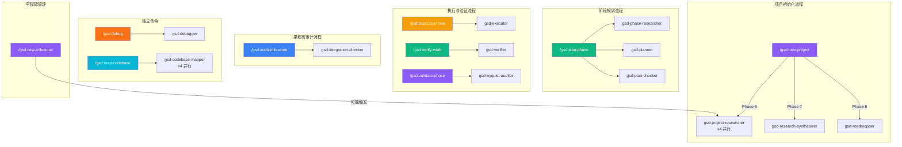
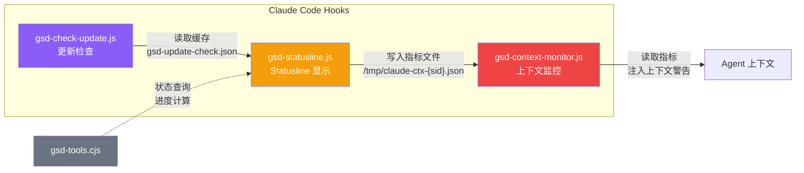
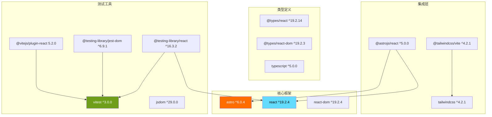
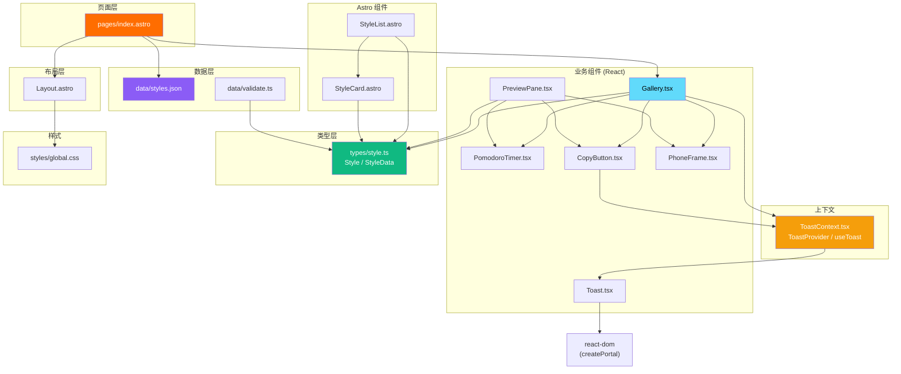
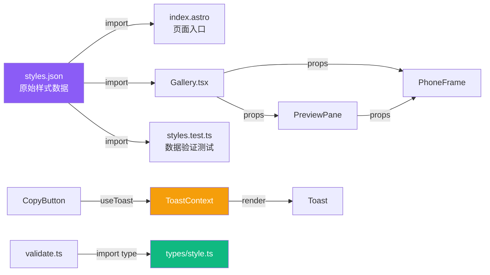

# 依赖图可视化文档

> GSD 框架内部依赖关系、Demo 项目依赖关系与关键耦合点分析

## 目录

1. [GSD Agent 编排图](#1-gsd-agent-编排图)
2. [Command -> Workflow -> Agent 调用链图](#2-command--workflow--agent-调用链图)
3. [Demo 项目组件依赖图](#3-demo-项目组件依赖图)
4. [关键耦合点分析](#4-关键耦合点分析)
5. [模块职责矩阵](#5-模块职责矩阵)

---

## 1. GSD Agent 编排图

GSD 框架包含 12 个专业代理，每个代理由特定的命令或编排器生成（Spawned by）。代理之间存在明确的数据消费关系。

### 1.1 Agent 生成关系



### 1.2 Agent 数据消费关系

代理之间通过文件产物（`.planning/` 目录）进行通信，而非直接调用。


### 1.3 Agent 通信机制汇总

| 生产者 | 产物文件 | 消费者 |
|--------|----------|--------|
| gsd-project-researcher (x4) | `.planning/research/STACK.md` 等 | gsd-research-synthesizer |
| gsd-research-synthesizer | `.planning/research/SUMMARY.md` | gsd-roadmapper |
| gsd-roadmapper | `.planning/ROADMAP.md`, `STATE.md` | gsd-phase-researcher, gsd-planner |
| gsd-phase-researcher | `{phase}-RESEARCH.md` | gsd-planner |
| gsd-planner | `{phase}-PLAN.md` | gsd-plan-checker, gsd-executor |
| gsd-plan-checker | 修订反馈（返回编排器） | gsd-planner |
| gsd-executor | `{phase}-SUMMARY.md` | gsd-verifier |
| gsd-codebase-mapper | `.planning/codebase/*.md` | gsd-planner, gsd-executor |
| gsd-verifier | `{phase}-VERIFICATION.md` | gsd-nyquist-auditor |
| gsd-integration-checker | 集成报告（返回审计器） | audit-milestone 编排器 |

---

## 2. Command -> Workflow -> Agent 调用链图

每个 GSD 命令引用一个 workflow 文件，workflow 内部编排 Agent 的生成。`gsd-tools.cjs` 是所有命令共用的运行时工具库。

### 2.1 核心工作流调用链

```mermaid
flowchart TB
    subgraph "运行时基础设施"
        GT["gsd-tools.cjs<br/>bin/lib/ 运行时工具"]
        subgraph "Hooks"
            HM["gsd-context-monitor.js<br/>上下文监控"]
            HS["gsd-statusline.js<br/>状态栏显示"]
            HU["gsd-check-update.js<br/>更新检查"]
        end
    end

    subgraph "项目创建流"
        C1["/gsd:new-project"] --> W1["workflows/new-project.md"]
        W1 --> A1["gsd-project-researcher x4"]
        W1 --> A2["gsd-research-synthesizer"]
        W1 --> A3["gsd-roadmapper"]
    end

    subgraph "规划流"
        C2["/gsd:plan-phase"] --> W2["workflows/plan-phase.md"]
        C2B["/gsd:research-phase"] --> W2B["workflows/research-phase.md"]
        C2C["/gsd:discuss-phase"] --> W2C["workflows/discuss-phase.md"]
        W2 --> A4["gsd-phase-researcher"]
        W2 --> A5["gsd-planner"]
        W2 --> A6["gsd-plan-checker"]
    end

    subgraph "执行流"
        C3["/gsd:execute-phase"] --> W3["workflows/execute-phase.md"]
        C3B["/gsd:quick"] --> W3B["workflows/quick.md"]
        W3 --> A7["gsd-executor"]
    end

    subgraph "验证流"
        C4["/gsd:verify-work"] --> W4["workflows/verify-work.md"]
        C4B["/gsd:validate-phase"] --> W4B["workflows/validate-phase.md"]
        W4 --> A8["gsd-verifier"]
        W4B --> A9["gsd-nyquist-auditor"]
    end

    subgraph "审计与调试"
        C5["/gsd:audit-milestone"] --> W5["workflows/audit-milestone.md"]
        C6["/gsd:debug"] --> W6["workflows/debug.md"]
        C7["/gsd:map-codebase"] --> W7["workflows/map-codebase.md"]
        W5 --> A10["gsd-integration-checker"]
        W6 --> A11["gsd-debugger"]
        W7 --> A12["gsd-codebase-mapper x4"]
    end

    C1 & C2 & C3 & C4 & C5 & C6 & C7 -.->|"所有命令依赖"| GT

    style GT fill:#EF4444,color:#fff
    style C1 fill:#8B5CF6,color:#fff
    style C2 fill:#10B981,color:#fff
    style C3 fill:#F59E0B,color:#fff
    style C4 fill:#10B981,color:#fff
    style C5 fill:#3B82F6,color:#fff
    style C6 fill:#F97316,color:#fff
    style C7 fill:#06B6D4,color:#fff
```



### 2.2 命令 -> Workflow 映射表

| 命令 | Workflow 文件 | 生成的 Agent |
|------|---------------|-------------|
| `/gsd:new-project` | `workflows/new-project.md` | gsd-project-researcher (x4) -> gsd-research-synthesizer -> gsd-roadmapper |
| `/gsd:new-milestone` | `workflows/new-milestone.md` | gsd-project-researcher (条件触发) |
| `/gsd:plan-phase` | `workflows/plan-phase.md` | gsd-phase-researcher -> gsd-planner -> gsd-plan-checker |
| `/gsd:research-phase` | `workflows/research-phase.md` | gsd-phase-researcher (独立) |
| `/gsd:discuss-phase` | `workflows/discuss-phase.md` | 无 (交互式讨论) |
| `/gsd:execute-phase` | `workflows/execute-phase.md` | gsd-executor |
| `/gsd:quick` | `workflows/quick.md` | gsd-executor (快速模式) |
| `/gsd:verify-work` | `workflows/verify-work.md` | gsd-verifier |
| `/gsd:validate-phase` | `workflows/validate-phase.md` | gsd-nyquist-auditor |
| `/gsd:audit-milestone` | `workflows/audit-milestone.md` | gsd-integration-checker |
| `/gsd:debug` | `workflows/debug.md` | gsd-debugger |
| `/gsd:map-codebase` | `workflows/map-codebase.md` | gsd-codebase-mapper (x4) |
| `/gsd:progress` | `workflows/progress.md` | 无 (读取状态) |
| `/gsd:pause-work` | `workflows/pause-work.md` | 无 (状态保存) |
| `/gsd:resume-work` | `workflows/resume-project.md` | 无 (状态恢复) |
| `/gsd:remove-phase` | `workflows/remove-phase.md` | 无 (文件操作) |
| `/gsd:insert-phase` | `workflows/insert-phase.md` | 无 (文件操作) |
| `/gsd:add-phase` | `workflows/add-phase.md` | 无 (文件操作) |
| `/gsd:complete-milestone` | `workflows/complete-milestone.md` | 无 (总结) |
| `/gsd:health` | `workflows/health.md` | 无 (状态检查) |
| `/gsd:help` | `workflows/help.md` | 无 (帮助输出) |
| `/gsd:update` | `workflows/update.md` | 无 (自更新) |
| `/gsd:settings` | `workflows/settings.md` | 无 (配置) |
| `/gsd:set-profile` | `workflows/set-profile.md` | 无 (配置) |
| `/gsd:add-todo` | `workflows/add-todo.md` | 无 (TODO 管理) |
| `/gsd:check-todos` | `workflows/check-todos.md` | 无 (TODO 检查) |
| `/gsd:add-tests` | `workflows/add-tests.md` | 无 (测试建议) |
| `/gsd:plan-milestone-gaps` | `workflows/plan-milestone-gaps.md` | 无 (差距分析) |
| `/gsd:list-phase-assumptions` | `workflows/list-phase-assumptions.md` | 无 (假设列表) |
| `/gsd:reapply-patches` | `workflows/reapply-patches.md` | 无 (补丁重应用) |
| `/gsd:cleanup` | `workflows/cleanup.md` | 无 (清理) |
| `/gsd:join-discord` | `workflows/join-discord.md` | 无 (链接输出) |

### 2.3 Hooks 依赖关系



**Hooks 协作机制：**

| Hook | 触发时机 | 依赖 | 产出 |
|------|---------|------|------|
| `gsd-statusline.js` | 每次状态栏刷新 | `gsd-tools.cjs` (STATE.md 查询)、`cache/gsd-update-check.json` | 终端状态栏文本 + `/tmp/claude-ctx-{sid}.json` 指标文件 |
| `gsd-context-monitor.js` | PostToolUse | `/tmp/claude-ctx-{sid}.json` | 上下文使用率警告注入 Agent |
| `gsd-check-update.js` | 定期检查 | npm registry / GitHub API | `cache/gsd-update-check.json` |

statusline 是监控的数据源，context-monitor 消费 statusline 产出的指标文件，两者形成生产者-消费者关系。

---

## 3. Demo 项目组件依赖图

### 3.1 npm 依赖关系



### 3.2 源码组件依赖图



### 3.3 数据流分析



---

## 4. 关键耦合点分析

### 4.1 高耦合区域

#### 耦合点 1: gsd-tools.cjs（全局运行时依赖）

**耦合度：极高**

`gsd-tools.cjs` 是所有 Agent 和 Workflow 的运行时基础。几乎所有 Agent 在初始化阶段都通过以下命令加载上下文：

```bash
INIT=$(node "$HOME/.claude/get-shit-done/bin/gsd-tools.cjs" init phase-op "${PHASE}")
```

**涉及的 Agent**：gsd-executor、gsd-planner、gsd-plan-checker、gsd-verifier、gsd-phase-researcher、gsd-debugger

**风险**：如果 `gsd-tools.cjs` 的 CLI 接口发生变更，所有 Agent 的初始化逻辑将同时失效。

**建议**：改动 `gsd-tools.cjs` 时必须全量回归测试所有涉及 `init` 子命令的 Agent。

#### 耦合点 2: PLAN.md 格式（Planner -> Checker -> Executor 链）

**耦合度：高**

gsd-planner 产出的 PLAN.md 是 gsd-plan-checker（验证质量）和 gsd-executor（执行任务）的共同输入。三者共享以下格式约定：

- frontmatter 字段（phase, plan, type, wave, depends_on, files_modified, autonomous, requirements, must_haves）
- XML 任务结构（`<task>`, `<files>`, `<action>`, `<verify>`, `<done>`）
- must_haves 子结构（truths, artifacts, key_links）

**风险**：planner 修改任何字段名或结构，checker 的 8 维验证和 executor 的任务解析将同时出错。

**建议**：任何 PLAN.md 格式变更需要同步更新 planner、checker、executor 三个 Agent 的解析逻辑。

#### 耦合点 3: ROADMAP.md / STATE.md（全局状态文件）

**耦合度：高**

多个 Agent 读写同一状态文件：

| 文件 | 写入者 | 读取者 |
|------|--------|--------|
| `ROADMAP.md` | gsd-roadmapper, gsd-executor | gsd-planner, gsd-phase-researcher, gsd-verifier |
| `STATE.md` | gsd-roadmapper, gsd-executor | gsd-planner, gsd-statusline |
| `REQUIREMENTS.md` | gsd-roadmapper, gsd-executor | gsd-plan-checker, gsd-verifier |

**风险**：并发写入可能导致状态丢失。目前通过编排器串行调度规避，但并行 Agent（如 4 个 codebase-mapper）写入同一目录需要注意。

#### 耦合点 4: Demo 项目 - ToastContext 跨组件渗透

**耦合度：中等**

`ToastContext` 被 Gallery、CopyButton、PreviewPane 的测试共同依赖：

- `Gallery.tsx` 提供 `ToastProvider`
- `CopyButton.tsx` 消费 `useToast`
- `PreviewPane.test.tsx` 需要包裹 `ToastProvider`
- `CopyButton.test.tsx` 需要包裹 `ToastProvider`

**风险**：修改 ToastContext 接口会影响多个组件和测试。

#### 耦合点 5: types/style.ts（Demo 类型核心）

**耦合度：中等**

`Style` 和 `StyleData` 类型被以下模块引用：

- `components/Gallery.tsx`
- `components/PreviewPane.tsx`
- `components/StyleList.astro`
- `components/StyleCard.astro`
- `data/validate.ts`
- `data/styles.json`（隐式对应）
- 全部相关测试文件

**风险**：类型定义变更会级联影响所有消费组件。

### 4.2 耦合度分级总览

| 耦合点 | 级别 | 涉及模块 | 改动影响范围 |
|--------|------|---------|-------------|
| gsd-tools.cjs | 极高 | 全部 Agent + Workflow | 全框架 |
| PLAN.md 格式 | 高 | planner / checker / executor | 规划-执行链 |
| ROADMAP.md / STATE.md | 高 | 多个 Agent（读写） | 全项目生命周期 |
| must_haves 结构 | 中 | planner / checker / verifier | 验证维度 |
| .planning/ 目录结构 | 中 | 所有有状态的 Agent | 文件发现逻辑 |
| ToastContext | 中 | Demo 多组件 + 测试 | UI 反馈层 |
| types/style.ts | 中 | Demo 组件 + 数据层 | 类型安全 |

---

## 5. 模块职责矩阵

### 5.1 GSD 框架模块职责

| 模块 | 职责 | 输入 | 输出 | 使用的工具 |
|------|------|------|------|-----------|
| **gsd-project-researcher** | 领域生态调研 | 项目描述、研究模式 | STACK.md, FEATURES.md, ARCHITECTURE.md, PITFALLS.md | WebSearch, WebFetch, Context7 |
| **gsd-research-synthesizer** | 综合研究结果 | 4 份研究文件 | SUMMARY.md | Read, Write |
| **gsd-roadmapper** | 创建项目路线图 | PROJECT.md, REQUIREMENTS.md, SUMMARY.md | ROADMAP.md, STATE.md | Read, Write, Bash |
| **gsd-phase-researcher** | 阶段技术调研 | 阶段描述、CONTEXT.md | RESEARCH.md | WebSearch, WebFetch, Context7 |
| **gsd-planner** | 创建可执行计划 | RESEARCH.md, ROADMAP.md | PLAN.md (多份) | Read, Write, Bash |
| **gsd-plan-checker** | 验证计划质量 | PLAN.md, ROADMAP.md | 验证报告/修订反馈 | Read, Bash |
| **gsd-executor** | 执行计划任务 | PLAN.md | 代码提交, SUMMARY.md | Read, Write, Edit, Bash |
| **gsd-verifier** | 验证阶段目标达成 | SUMMARY.md, ROADMAP.md | VERIFICATION.md | Read, Write, Bash |
| **gsd-nyquist-auditor** | 填补验证测试缺口 | VERIFICATION.md 缺口 | 测试文件, 更新后的 VALIDATION.md | Read, Write, Edit, Bash |
| **gsd-integration-checker** | 跨阶段集成验证 | 阶段 SUMMARYs | 集成报告 | Read, Bash |
| **gsd-debugger** | 系统化调试 | 问题描述 | 调试文件, 修复提交 | Read, Write, Edit, Bash |
| **gsd-codebase-mapper** | 代码库结构分析 | 焦点区域 (tech/arch/quality/concerns) | STACK.md, ARCHITECTURE.md 等 | Read, Write, Bash |

### 5.2 Demo 项目模块职责

| 模块 | 职责 | 类型 | 依赖 | 被依赖 |
|------|------|------|------|--------|
| **pages/index.astro** | 页面入口，组装 Gallery | Astro 页面 | Layout, Gallery, styles.json | 无 |
| **Layout.astro** | 全局布局与 CSS 引入 | Astro 布局 | global.css | index.astro |
| **Gallery.tsx** | 样式卡片列表，核心展示组件 | React 组件 | PomodoroTimer, CopyButton, PhoneFrame, ToastProvider, Style 类型 | index.astro |
| **PreviewPane.tsx** | 样式预览面板 | React 组件 | PomodoroTimer, CopyButton, PhoneFrame, Style 类型 | Gallery (间接) |
| **PomodoroTimer.tsx** | 番茄钟计时器 | React 组件 | React hooks | Gallery, PreviewPane |
| **CopyButton.tsx** | 复制到剪贴板按钮 | React 组件 | useToast | Gallery, PreviewPane |
| **PhoneFrame.tsx** | 手机外框容器 | React 组件 | 无 | Gallery, PreviewPane |
| **Toast.tsx** | 通知提示组件 | React 组件 | react-dom (portal) | ToastContext |
| **ToastContext.tsx** | Toast 状态管理 | React Context | Toast 组件 | Gallery, CopyButton |
| **StyleList.astro** | 样式列表 (Astro) | Astro 组件 | Style 类型, StyleCard | 页面引用 |
| **StyleCard.astro** | 样式卡片 (Astro) | Astro 组件 | Style 类型 | StyleList |
| **types/style.ts** | Style / StyleData 类型定义 | TypeScript 类型 | 无 | 6+ 组件/模块 |
| **data/styles.json** | 样式数据源 | JSON 数据 | 无 | Gallery, 测试 |
| **data/validate.ts** | 数据验证函数 | TypeScript 工具 | Style 类型 | 测试 |
| **styles/global.css** | 全局样式 | CSS | 无 | Layout |

### 5.3 GSD 生命周期阶段矩阵

展示每个阶段涉及哪些 Agent 和文件：

| 生命周期阶段 | 触发命令 | 涉及 Agent | 产出文件 |
|-------------|---------|-----------|---------|
| 项目初始化 | `/gsd:new-project` | project-researcher -> synthesizer -> roadmapper | ROADMAP.md, STATE.md, REQUIREMENTS.md |
| 代码库分析 | `/gsd:map-codebase` | codebase-mapper (x4) | .planning/codebase/*.md |
| 阶段讨论 | `/gsd:discuss-phase` | 无 (交互式) | CONTEXT.md |
| 阶段研究 | `/gsd:research-phase` | phase-researcher | RESEARCH.md |
| 阶段规划 | `/gsd:plan-phase` | phase-researcher -> planner -> plan-checker | PLAN.md (多份) |
| 阶段执行 | `/gsd:execute-phase` | executor | 代码提交, SUMMARY.md |
| 工作验证 | `/gsd:verify-work` | verifier | VERIFICATION.md |
| 阶段验证 | `/gsd:validate-phase` | nyquist-auditor | 测试文件, VALIDATION.md |
| 里程碑审计 | `/gsd:audit-milestone` | integration-checker | 审计报告 |
| 调试 | `/gsd:debug` | debugger | 调试文件, 修复提交 |
| 工作暂停 | `/gsd:pause-work` | 无 | STATE.md 更新 |
| 工作恢复 | `/gsd:resume-work` | 无 | 状态恢复 |

---

*文档生成时间：2026-04-04*
*基于 get-shit-done 框架源码分析*
