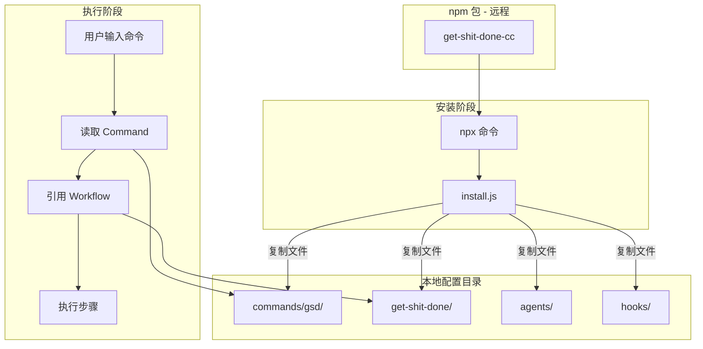

# Command 与 Workflow 分离架构

> GSD 框架采用两层架构：Command 负责声明，Workflow 负责实现。

## 相关源码路径

| 组件 | 相对路径 | 完整路径 |
|------|----------|----------|
| Command 入口示例 | `get-shit-done/commands/gsd/update.md` | `/Users/jiashengwang/jacky-github/get-shit-done-study/get-shit-done/commands/gsd/update.md` |
| Workflow 实现示例 | `get-shit-done/get-shit-done/workflows/update.md` | `/Users/jiashengwang/jacky-github/get-shit-done-study/get-shit-done/get-shit-done/workflows/update.md` |
| Planner Agent | `get-shit-done/agents/gsd-planner.md` | `/Users/jiashengwang/jacky-github/get-shit-done-study/get-shit-done/agents/gsd-planner.md` |
| 安装脚本 | `get-shit-done/bin/install.js` | `/Users/jiashengwang/jacky-github/get-shit-done-study/get-shit-done/bin/install.js` |

## 问题

框架如何让命令既易于理解，又易于维护？

## 答案

### 核心思想

将"做什么"（Command）与"怎么做"（Workflow）分离：

- **Command**：薄薄的入口层，定义元数据和依赖
- **Workflow**：厚厚的实现层，包含具体步骤和逻辑

### 两层职责

| 层级 | 文件位置 | 职责 | 内容 |
|------|----------|------|------|
| **Command** | `commands/gsd/*.md` | 声明"做什么" | name, description, allowed-tools, 依赖引用 |
| **Workflow** | `workflows/*.md` | 定义"怎么做" | steps, conditions, bash 命令, 交互逻辑 |

### Command 文件结构

```yaml
---
name: gsd:update
description: Update GSD to latest version
allowed-tools:          # 声明允许使用的工具（最小权限原则）
  - Bash
  - AskUserQuestion
---

<objective>            # 目标描述
  Check for updates, install if available...
</objective>

<execution_context>    # 引用的实现文件（依赖注入）
  @~/.claude/get-shit-done/workflows/update.md
</execution_context>
```

### Workflow 文件结构

```markdown
<purpose>Check for GSD updates via npm...</purpose>

<step name="get_installed_version">
  检测本地/全局安装...
  ```bash
  # 具体的 bash 命令
  ```
</step>

<step name="check_latest_version">
  ```bash
  npm view get-shit-done-cc version
  ```
</step>

<success_criteria>
  - [ ] Installed version read correctly
  - [ ] User confirmation obtained
</success_criteria>
```

## 阶段一：安装流程

```
┌─────────────────────────────────────────────────────────────┐
│  npm 包 (get-shit-done-cc@latest)                           │
│                                                              │
│  ├── commands/gsd/        # 命令入口文件                      │
│  ├── agents/              # 子代理定义                        │
│  ├── get-shit-done/       # 核心实现                          │
│  │   ├── workflows/       # 工作流                            │
│  │   ├── templates/       # 模板                              │
│  │   ├── references/      # 参考文档                          │
│  │   └── bin/             # 工具脚本                          │
│  ├── hooks/dist/          # 钩子脚本                          │
│  └── bin/install.js       # 安装程序                          │
└─────────────────────────────────────────────────────────────┘
                              │
                              │ copyWithPathReplacement()
                              ▼
┌─────────────────────────────────────────────────────────────┐
│  目标目录 (~/.claude/ 或 ./.claude/)                         │
│                                                              │
│  ├── commands/gsd/        ✓ Installed commands/gsd          │
│  ├── get-shit-done/       ✓ Installed get-shit-done         │
│  │   ├── workflows/                                        │
│  │   ├── templates/                                        │
│  │   ├── references/                                       │
│  │   └── VERSION         ✓ Wrote VERSION (1.22.4)          │
│  ├── agents/                                                │
│  │   └── gsd-*.md        ✓ Installed agents                 │
│  ├── hooks/              ✓ Installed hooks                   │
│  ├── gsd-file-manifest.json  ✓ Wrote file manifest          │
│  └── package.json        ✓ Wrote package.json (CommonJS)    │
└─────────────────────────────────────────────────────────────┘
```

## 阶段二：命令执行流程

```
┌─────────────────────────────────────────────────────────────┐
│  用户输入: /gsd:update                                       │
└─────────────────────────────────────────────────────────────┘
                              │
                              ▼
┌─────────────────────────────────────────────────────────────┐
│  Step 1: 读取命令入口                                        │
│  ~/.claude/commands/gsd/update.md                           │
│                                                              │
│  内容:                                                       │
│  - name: gsd:update                                          │
│  - allowed-tools: [Bash, AskUserQuestion]                   │
│  - execution_context: @~/.claude/.../workflows/update.md    │
└─────────────────────────────────────────────────────────────┘
                              │
                              │ @ 引用
                              ▼
┌─────────────────────────────────────────────────────────────┐
│  Step 2: 读取工作流实现                                      │
│  ~/.claude/get-shit-done/workflows/update.md                │
│                                                              │
│  内容:                                                       │
│  - <step name="get_installed_version">                      │
│  - <step name="check_latest_version">                       │
│  - <step name="run_update">                                 │
│  - ...                                                       │
└─────────────────────────────────────────────────────────────┘
                              │
                              │ 执行步骤
                              ▼
┌─────────────────────────────────────────────────────────────┐
│  Step 3: 执行工作流                                          │
│                                                              │
│  • 读取 VERSION 文件                                         │
│  • 调用 npm view 检查最新版本                                 │
│  • 比较版本                                                  │
│  • 显示 changelog                                            │
│  • 用户确认                                                  │
│  • 执行更新                                                  │
└─────────────────────────────────────────────────────────────┘
```

## 完整数据流（Mermaid）



## 安装时的路径替换

```javascript
// install.js 中的处理
content = content.replace(/~\/\.claude\//g, pathPrefix);
```

命令文件中的 `@~/.claude/...` 会被替换为实际的安装路径。

## 设计亮点

1. **关注点分离**：接口与实现解耦
2. **工具权限控制**：每个命令明确声明需要的工具
3. **可复用**：一个 workflow 可被多个 command 引用
4. **可维护**：修改实现不影响命令接口

## 类比

| GSD | 类比 |
|-----|------|
| Command | API Route (定义接口) |
| Workflow | Service Layer (实现逻辑) |
| References | Utils/Helpers |
| Templates | View Templates |

## 可复用场景

- [ ] jacky-skills：可以将 skill 定义与实现分离
- [ ] 任何需要声明式接口 + 命令式实现的场景
